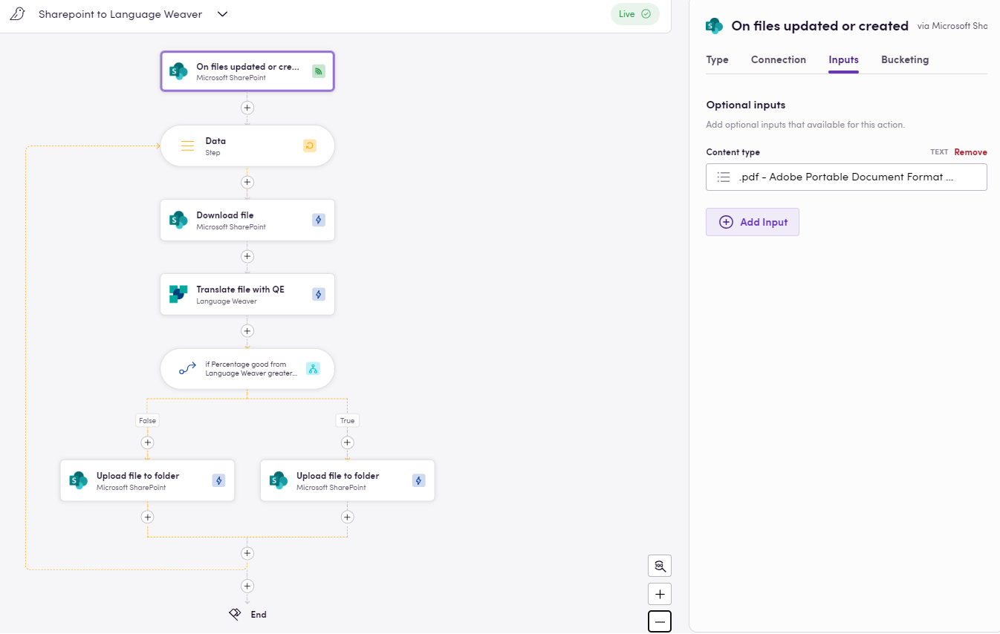
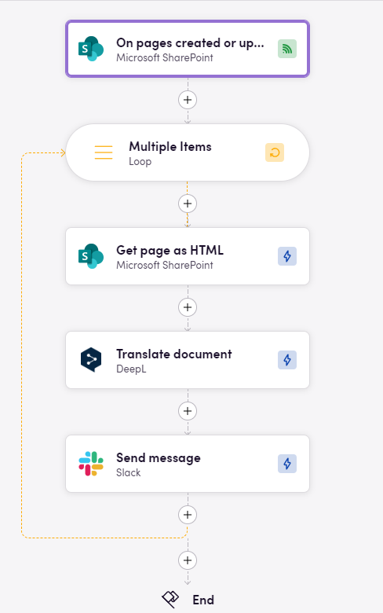

# Blackbird.io Microsoft SharePoint

Blackbird is the new automation backbone for the language technology industry. Blackbird provides enterprise-scale automation and orchestration with a simple no-code/low-code platform. Blackbird enables ambitious organizations to identify, vet and automate as many processes as possible. Not just localization workflows, but any business and IT process. This repository represents an application that is deployable on Blackbird and usable inside the workflow editor.

## Introduction

<!-- begin docs -->

SharePoint is a platform developed by Microsoft that serves as a central hub for collaboration, document management, and content sharing within organizations. It allows users to create, store, and access documents, as well as collaborate on projects in a secure and organized online environment.

## Before setting up

Before you can connect you need to make sure that:

- You have a Microsoft 365 account.
- You have a [SharePoint site created](https://support.microsoft.com/en-gb/office/create-a-site-in-sharepoint-4d1e11bf-8ddc-499d-b889-2b48d10b1ce8).

### How to find site name

You can find the site name:

- On SharePoint start page.

- OR By clicking on _My sites_ tab.

From there, you can view your sites and choose the one you want to work with. 

Copy the site name. For example, if the site name is "My communication site", copy this.

## Connecting

1. Navigate to apps and search for Microsoft SharePoint. If you cannot find Microsoft SharePoint then click _Add App_ in the top right corner, select Microsoft SharePoint and add the app to your Blackbird environment.
2. Click _Add Connection_.
3. Name your connection for future reference e.g. 'My organization'.
4. Fill in the display name of your site e.g. 'My communication site'. 
5. Click _Authorize connection_.
6. Follow the instructions that Microsoft gives you, authorizing Blackbird.io to act on your behalf.
7. When you return to Blackbird, confirm that the connection has appeared and the status is _Connected_.

Note: if you have just created a site, you should wait a couple of minutes before trying to connect.

## Actions

### Documents

- **Get file metadata** retrieves the metadata for a file from site documents.
- **List changed files** returns a list of all files that have been created or modified during past hours. If number of hours is not specified, files changed during past 24 hours are listed.
- **Download file**.
- **Upload file to folder**.
- **Delete file**.
- **Get folder metadata** retrieves the metadata for a folder.
- **List files in folder** retrieves metadata for files contained in a folder.
- **Create folder in parent folder**.
- **Delete folder**.

## Events

- **On files updated or created** is triggered when files are updated or created.
- **On folders updated or created** is triggered when folders are updated or created.
- **On pages created or updated** this polling event is triggered when pages are updated or created.
- **On pages deleted** this polling event is triggered when pages are deleted.

## Example
Example 1

Here, whenever PDF files are uploaded to SharePoint Documents, each file is downloaded, translated with Language Weaver and placed in the appropriate directory based on the translation quality assessment.

Example 2

In this example, the workflow starts with the **On pages created or updated**. Then, the workflow uses the **Get page as HTML** action to get html content of updated/created page. In the next step we translate this content via DeepL and then send the translated page to Slack channel.
## Missing features

In the future we can add actions for lists. Let us know if you're interested!

<!-- end docs -->
